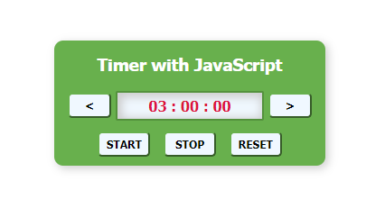

# santander-coders-fst-live1-timer
### Santander Coders - Web Full Stack

Demo timer application developed during first live event and enhanced later.

Implemented to countdown minutes, seconds and miliseconds.

Later added start/stop/reset/increase/decrease time functions.

Developed using plain HTML/CSS/JavaScript.

Powered by Let's Code and Santander Universidades
